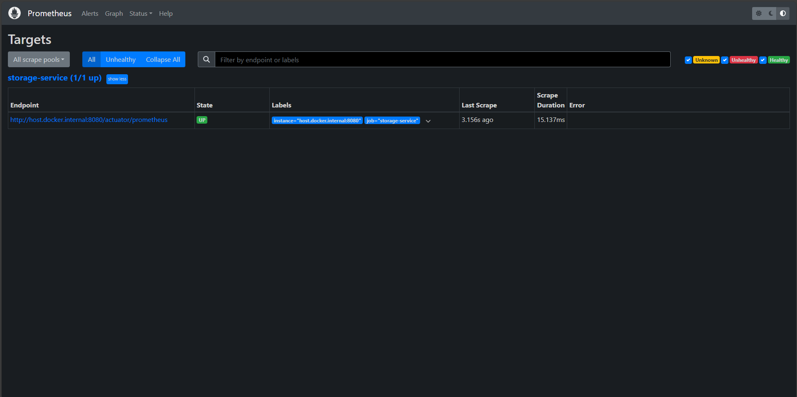

## STORAGE-SERVICE-BACKEND

This service is exposing storage management service through an exposed Open Api REST.

# Build service

Maven need to be installed for build the application. Detailed
instructions [here](https://maven.apache.org/install.html)

````
mvn clean install -U
````

# Initialization

The app listening on port 8080 by default

````
mvn springboot:run
````

# Usage

Use Postman to test the api outside without a frontend. Or you can access through
swagger [here](http://localhost:8080/swagger-ui/index.html#)

# Open-Api REST

The application is designed with delegate pattern of open-api RESTFull services and also document through the API
standards.

There is provided to handling custom generic operation exception.

# Spring Doc Open-Api


# Monitoring & Observability

The service is providing a standard spring-actuator endpoint. Also, tools are provided for this purpose with prometheus
and grafana. As show as follows:

## Prometheus

The service is prepared to process custom metrics if it's necessary.



## Grafana

Allow us to have monitored the service with custom dashboard, in the image is show standard spring-boot apm.


# Docker containerization

Is necessary install docker depending on your SO, https://docs.docker.com/engine/install/. The service will create three
containers:

- prometheus
- grafana

Execute next command showed as follows from root folder:

````
docker-compose up --build
````

### Java Inspections

- See the [Coding Guidelines]

- No warnings are allowed for new code

- Use Java code inspections. The profile should be auto imported by Intellij. The project has configured inspection
  profiles on
  the `.idea/inspectionProfiles` folder


- To run the code inspections over the whole code base:

> Code -> Inspect Code -> Inspection Scope: Whole project

### Java Code Styles

### Commit Guidelines

We adhere to the conventional commits standard to define a single format among all developers when
committing. [conventional-commits](https://www.conventionalcommits.org/en/v1.0.0/) for example:

`feat(core): GMDP-123 improve validation logic`

All parts are mandatory as part of the team agreement.

- Valid types:

    - feat: A new feature
    - fix: A bug fix
    - docs: Documentation only changes
    - style: Changes that do not affect the meaning of the code
    - refactor: A code change that neither fixes a bug nor adds a feature
    - build: A code change related with the build system
    - perf: A code change that improves performance
    - test: Adding missing tests
    - revert: Revert to a commit
    - ci: Changes to Continuous Integration and deployment system

- Valid scopes:

    - security: Things related with vulnerabilities or security in general
    - core: Regular dependency maintenance or elements that affect the entire application at a high level, or are of a
      more general character
    - database: Everything related with database
    - open api: Everything related with open api generation
    - prices: Everything related with prices.

- The description should start with a verb of one of the valid list:
    - `add|adapt|adjust|break|build|change|check|clean|clear|config|connect|create|delete|downgrade|exclude|extract|fix|focus|force
      |improve|include|increase|integrate|make|merge|modify|move|recreate|remove|replace|test|update|use|document|rename`
- The description should contain at least two words
- The maximum commit message length is 72 characters